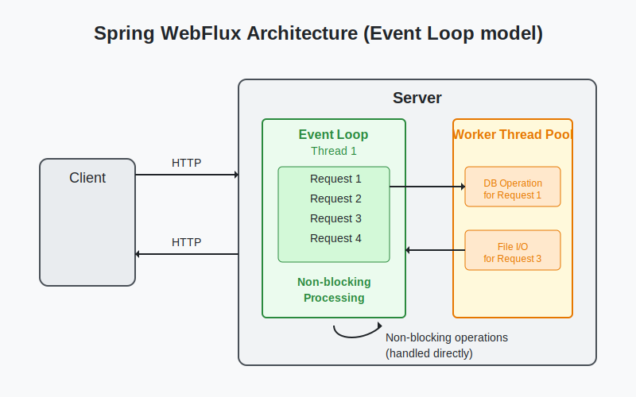

# Spring WebFlux Product API

A comprehensive demonstration project for building reactive applications with Spring WebFlux.



## Overview

This project showcases a complete reactive web application built with Spring WebFlux. It demonstrates both annotation-based and functional programming approaches for building scalable, non-blocking web services that can handle high concurrency with minimal resource usage.

The application is a simple product management API that allows creating, reading, updating, and deleting products, as well as streaming real-time product updates using Server-Sent Events (SSE).

## Features

- **Fully Reactive Stack**: End-to-end reactive programming using Spring WebFlux and Project Reactor
- **Dual API Implementation**:
  - Traditional annotation-based controllers
  - Functional endpoints with router functions and handlers
- **Real-time Updates**: Server-Sent Events (SSE) for streaming product changes
- **In-memory Database**: Reactive repository using `ConcurrentHashMap`
- **Comprehensive Error Handling**: Global error handler with appropriate HTTP status codes
- **Interactive UI**: HTML/JavaScript front-end to demonstrate API features
- **Reactive Client**: WebClient examples for communicating with reactive APIs
- **Performance Examples**: Patterns for handling CPU-intensive operations and backpressure
- **Metrics Integration**: Ready for monitoring with Micrometer
- **CORS Support**: Cross-Origin Resource Sharing configuration
- **Extensive Test Coverage**: Unit and integration tests for all components

## Architecture

The project follows a standard layered architecture:

1. **Model Layer**: Data classes representing domain entities
2. **Repository Layer**: Data access operations with reactive APIs
3. **Service Layer**: Business logic with reactive processing
4. **Web Layer**: Two implementations of web endpoints:
   - Annotation-based controllers with `@RestController`
   - Functional endpoints with handler and router functions

## Prerequisites

- Java 17 or higher
- Maven 3.6+ or Gradle 7.0+

## Getting Started

### Building with Maven

```bash
# Clone the repository
git clone https://github.com/yourusername/spring-webflux-products.git
cd spring-webflux-products

# Build the project
mvn clean package

# Run the application
mvn spring-boot:run
```

### Building with Gradle

```bash
# Clone the repository
git clone https://github.com/yourusername/spring-webflux-products.git
cd spring-webflux-products

# Build the project
./gradlew build

# Run the application
./gradlew bootRun
```

### Docker Deployment

```bash
# Build Docker image
docker build -t spring-webflux-products .

# Run container
docker run -p 8080:8080 spring-webflux-products
```

## API Endpoints

### Annotation-based API

| Method | URL | Description |
|--------|-----|-------------|
| GET | `/api/products` | Get all products |
| GET | `/api/products?cheaperThan=X` | Get products cheaper than price X |
| GET | `/api/products/sorted` | Get all products sorted by name |
| GET | `/api/products/{id}` | Get product by ID |
| GET | `/api/products/events` | Stream product updates (SSE) |
| POST | `/api/products` | Create a new product |
| PUT | `/api/products/{id}` | Update an existing product |
| DELETE | `/api/products/{id}` | Delete a product |

### Functional API

| Method | URL | Description |
|--------|-----|-------------|
| GET | `/api/functional/products` | Get all products |
| GET | `/api/functional/products/sorted` | Get products sorted by name |
| GET | `/api/functional/products/cheaper` | Get products cheaper than price X |
| GET | `/api/functional/products/{id}` | Get product by ID |
| GET | `/api/functional/products/events` | Stream product updates (SSE) |
| POST | `/api/functional/products` | Create a new product |
| PUT | `/api/functional/products/{id}` | Update an existing product |
| DELETE | `/api/functional/products/{id}` | Delete a product |

## Testing the API

### Using cURL

```bash
# Get all products
curl -X GET http://localhost:8080/api/products

# Create a product
curl -X POST http://localhost:8080/api/products \
  -H "Content-Type: application/json" \
  -d '{"name":"New Product","price":299.99}'

# Update a product
curl -X PUT http://localhost:8080/api/products/1 \
  -H "Content-Type: application/json" \
  -d '{"name":"Updated Product","price":349.99}'

# Delete a product
curl -X DELETE http://localhost:8080/api/products/1

# Stream product updates
curl -X GET http://localhost:8080/api/products/events \
  -H "Accept: text/event-stream"
```

### Using Web Interface

Open your browser and navigate to `http://localhost:8080` to access the interactive web interface.

## Project Structure

```
src
├── main
│   ├── java
│   │   └── com
│   │       └── example
│   │           ├── ReactiveApplication.java
│   │           ├── client
│   │           │   └── WebClientExample.java
│   │           ├── config
│   │           │   └── WebFluxConfig.java
│   │           ├── controller
│   │           │   └── ProductController.java
│   │           ├── exception
│   │           │   └── GlobalErrorHandler.java
│   │           ├── handler
│   │           │   └── ProductHandler.java
│   │           ├── metrics
│   │           │   └── MetricsConfig.java
│   │           ├── model
│   │           │   └── Product.java
│   │           ├── performance
│   │           │   └── PerformanceExample.java
│   │           ├── repository
│   │           │   └── ProductRepository.java
│   │           ├── router
│   │           │   └── ProductRouter.java
│   │           └── service
│   │               └── ProductService.java
│   └── resources
│       ├── application.properties
│       └── static
│           └── index.html
└── test
    └── java
        └── com
            └── example
                ├── controller
                │   └── ProductControllerTest.java
                ├── repository
                │   └── ProductRepositoryTest.java
                ├── router
                │   └── ProductRouterTest.java
                └── service
                    └── ProductServiceTest.java
```

## Key Technical Concepts

### Event Loop Model

Unlike traditional Spring MVC which uses a thread-per-request model, Spring WebFlux uses an event loop model with a small number of threads handling many concurrent requests. This architecture is illustrated in the diagram at the top of this README.

### Reactive Streams

The application leverages Project Reactor's `Mono` and `Flux` types for handling asynchronous data streams with non-blocking backpressure:

- `Mono<T>`: Represents 0 or 1 elements
- `Flux<T>`: Represents 0 to N elements

### Backpressure

The project demonstrates handling backpressure (when a consumer processes data more slowly than the producer sends it) using various strategies:

- Buffer-based backpressure
- Rate limiting
- Sampling

### Performance Optimization

Several performance patterns are demonstrated:

- Managing CPU-intensive operations on dedicated thread pools
- Parallel processing with controlled concurrency
- Chunking large datasets
- Tuning connection pools

## Contributing

1. Fork the project
2. Create your feature branch (`git checkout -b feature/amazing-feature`)
3. Commit your changes (`git commit -m 'Add some amazing feature'`)
4. Push to the branch (`git push origin feature/amazing-feature`)
5. Open a Pull Request

## License

This project is licensed under the MIT License - see the LICENSE file for details.

## Acknowledgments

- Spring Framework team for their excellent WebFlux documentation
- Project Reactor team for the reactive programming foundations